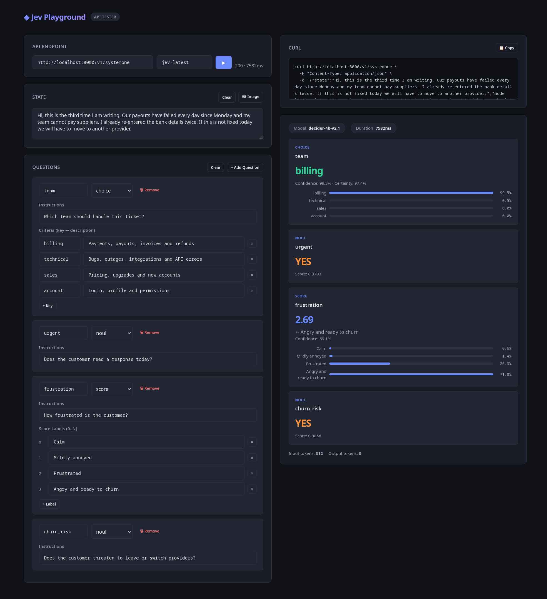

# Jev Playground

Vibe coded single-html Jev API tester with image support.
It was made quickly with deepseek 4 but the result is too good to just keep it for myself.

## Features:

- Convenient State and Questions editing
- CURL command generation
- CURL command importer
- File picker for the base64-encoded image state
- Pure JS in a single HTML

## Image State

Image state has the following model

```json
{"type": "image_url", "image_url": {"url": "data:image/png;base64,BASE64ImageData"}}
```

## License

MIT

## Screenshot


